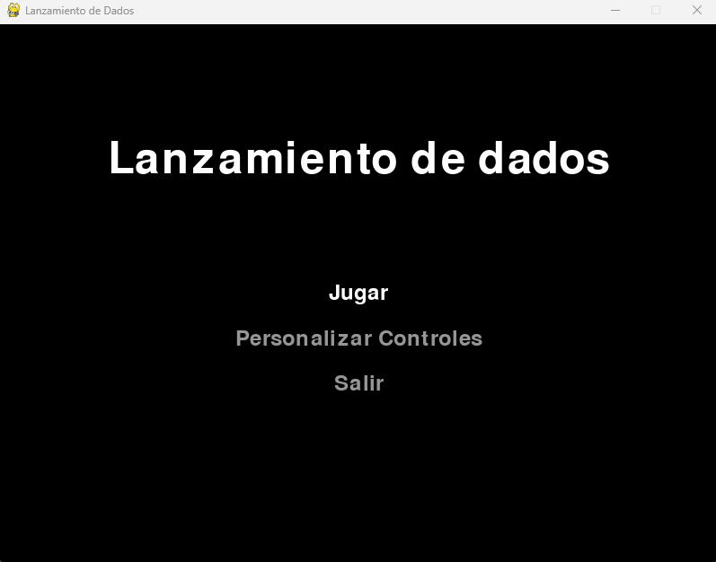

# Lanzamiento de Dados

## Descripción
Este es un juego de lanzamiento de dados implementado en Python utilizando la biblioteca Pygame. Ofrece una interfaz gráfica intuitiva donde los jugadores pueden lanzar dos dados y ver sus resultados, con características adicionales como historial de lanzamientos y menús interactivos.

## Características
- Interfaz gráfica completa
- Dados visuales con animación de puntos
- Historial de lanzamientos
- Menú principal y menú de pausa
- Contador de lanzamientos
- Personalización de controles
- Cálculo automático de la suma de los dados

## Capturas

### Menu principal

### Controles

### Menu de pausa

### Juego

## Requisitos
- Python 3.x
- Pygame

## Cómo jugar
1. Inicia el juego y selecciona "Jugar" en el menú principal
2. Presiona la tecla ESPACIO para lanzar los dados
3. Los resultados se mostrarán visualmente en la pantalla
4. El historial de lanzamientos se mantendrá en la parte inferior
5. Presiona R para reiniciar la partida
6. Presiona ESC para acceder al menú de pausa

### Controles predeterminados
- **ESPACIO**: Lanzar dados
- **R**: Reiniciar juego
- **ESC**: Abrir menú de pausa
- **Flechas arriba/abajo**: Navegar por los menús
- **Enter**: Seleccionar opción en los menús

## Características técnicas
- Resolución de pantalla: 800x600 píxeles
- Dados renderizados con gráficos vectoriales
- Sistema de menús completo
- Personalización de controles en tiempo real

## Funcionalidades implementadas
- Generación aleatoria de valores de dados
- Representación visual de los dados con puntos
- Sistema de historial de lanzamientos
- Menús interactivos con múltiples opciones
- Sistema de pausa con opciones de reanudar, reiniciar y volver al menú
- Personalización completa de controles